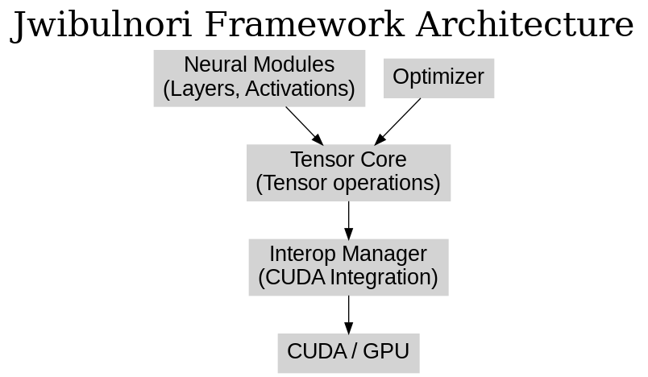

# Jwibulnori


### C# AI Framework

---

## 🎇 What is Jwibulnori?

**Jwibulnori (쥐불놀이)** is a traditional Korean folk game celebrated during the first full moon of the lunar calendar (Jeongwol Daeboreum). Participants spin burning cans filled with embers, creating beautiful spirals of fire in the night sky. Historically, this ritual symbolizes the burning away of harmful insects and weeds, wishing for prosperity and good harvests in the coming year.

Inspired by this tradition, the **Jwibulnori framework** metaphorically represents the illumination and deep exploration of neural network internals through low-level GPU acceleration and intuitive visualization tools. Just like spinning fire reveals mesmerizing patterns, Jwibulnori reveals the intricate details and hidden potentials within deep learning models.

---

## Introduction

**Jwibulnori** is a C#-based AI framework supporting tensor operations, neural network modules, and CUDA integration. It is designed for researchers, developers, and students alike, facilitating the easy creation and training of deep learning models in C#. With its intuitive API and GPU acceleration, Jwibulnori enables efficient deep learning experimentation.

---

## Features
- **Multi-dimensional tensor operations with autograd** – Supports N-dimensional tensors and automatic differentiation.
- **Modular neural network components** – Includes layers, activation functions, and more for easy model construction.
- **Built-in optimizers** – Implements SGD, Adam, and other algorithms for model training.
- **GPU acceleration via CUDA** – Executes tensor computations on GPU for improved performance.
- **Simple and intuitive API** – Accessible for beginners and powerful enough for experts.

---

## Installation
Install via NuGet Package Manager or .NET CLI:

**Package Manager Console:**
```powershell
PM> Install-Package Jwibulnori
```

**.NET CLI:**
```bash
dotnet add package Jwibulnori
```

---

## Usage Example
A simple tensor addition:

```csharp
using Jwibulnori;

Tensor A = new Tensor(new float[,] { {1, 2}, {3, 4} });
Tensor B = Tensor.Ones(2, 2);
Tensor C = A + B;
Console.WriteLine(C);  // Output: [[2, 3], [4, 5]]
```

---

## Framework Architecture



The Jwibulnori framework features a layered architecture:

- **Tensor Core** – Manages tensor operations and automatic differentiation.
- **Neural Modules** – Provides neural network components (layers, activations).
- **Optimizer** – Contains training algorithms (SGD, Adam).
- **Interop Manager** – Manages CUDA and external libraries integration.

---

## NuGet Package Description

**Jwibulnori** is an open-source deep learning framework for .NET/C#. It offers tensor-based computations, modular neural network components, and GPU acceleration to simplify deep learning model construction and training.

**Key features:**
- Intuitive and simple API
- Automatic differentiation and tensor operations
- Built-in neural layers and activations
- SGD, Adam optimizers included
- CUDA GPU acceleration

**Quick Start Example:**

```csharp
using Jwibulnori;

Tensor A = new Tensor(new float[,] { {1, 2}, {3, 4} });
Tensor B = Tensor.Ones(2, 2);
Tensor C = A + B;
Console.WriteLine(C);
```

---

## User Documentation and Examples

### Tensor Creation and Operations

```csharp
Tensor t1 = Tensor.Arange(1, 7).Reshape(2, 3);
Tensor t2 = Tensor.Ones(2, 3) * 2;
Tensor sum = t1 + t2;
Tensor product = t1 * t2;
Console.WriteLine(sum);     // [[3, 4, 5], [6, 7, 8]]
Console.WriteLine(product); // [[2, 4, 6], [8, 10, 12]]
```

### Simple Model & Training Loop

```csharp
int inputDim = 784, hiddenDim = 128, outputDim = 10;
var model = new Sequential(
    new Dense(inputDim, hiddenDim),
    new ReLU(),
    new Dense(hiddenDim, outputDim)
);
var optimizer = new SGD(model.Parameters, lr: 0.01f);
for (int epoch = 1; epoch <= 5; epoch++) {
    Tensor x = Tensor.RandomNormal(64, inputDim);
    Tensor target = Tensor.RandomNormal(64, outputDim);
    Tensor output = model.Forward(x);
    Tensor loss = Loss.MSE(output, target);
    optimizer.ZeroGrad();
    loss.Backward();
    optimizer.Step();
    Console.WriteLine($"Epoch {epoch}, Loss: {loss.ToScalar():F4}");
}
```

### MNIST Classifier Example

```csharp
var (trainData, testData) = Dataset.LoadMNIST();
var model = new Sequential(
    new Dense(784, 128), new ReLU(),
    new Dense(128, 10)
);
var optimizer = new Adam(model.Parameters, lr: 0.001f);
for (int epoch = 1; epoch <= 5; epoch++) {
    foreach ((Tensor x, Tensor label) in trainData) {
        Tensor pred = model.Forward(x);
        Tensor loss = Loss.CrossEntropy(pred, label);
        optimizer.ZeroGrad();
        loss.Backward();
        optimizer.Step();
    }
    float testAcc = EvaluateAccuracy(model, testData);
    Console.WriteLine($"Epoch {epoch}: Test Accuracy = {testAcc * 100:F2}%");
}
```

---

## License

MIT License.